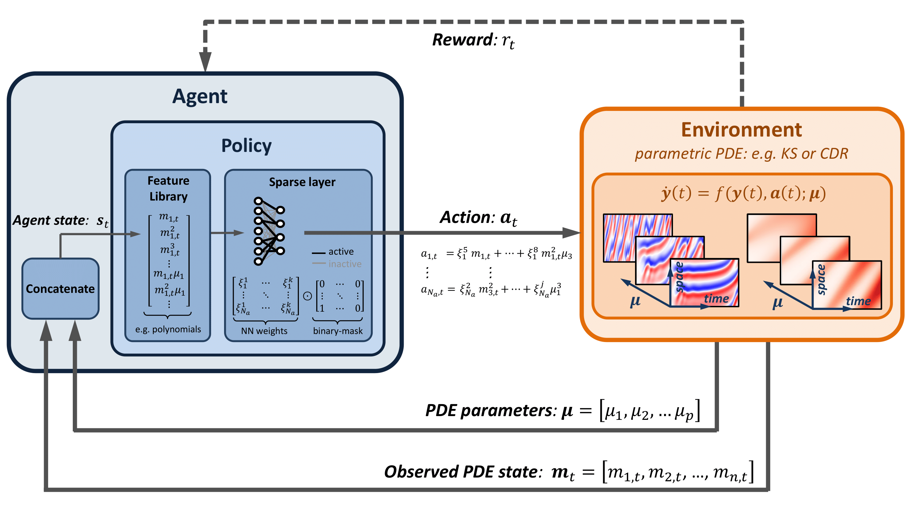

# Sparsifying Parametric Models with L0 regularization

Code accompanying the papers:

**[1] Parametric PDE Control with Deep Reinforcement Learning and Differentiable L0-Sparse Polynomial Policies**
Nicolò Botteghi and Urban Fasel. \
The paper has been accepted to the 63rd IEEE Conference on Decision and Control and can be found at: [Link](https://arxiv.org/pdf/2403.15267)



**[2] Sparsifying Parametric Models with L$_0$ Regularization** \
Nicolò Botteghi and Urban Fasel \
This document contains an educational introduction to the problem of sparsifying parametric models with L0 regularization. We utilize this approach together with dictionary learning to learn sparse polynomial policies for deep reinforcement learning to control parametric partial differential equations. 

## Cite
If you use this code in your own work, please cite our paper:
```
@article{botteghi2024parametric,
  title={Parametric PDE Control with Deep Reinforcement Learning and Differentiable L0-Sparse Polynomial Policies},
  author={Botteghi, Nicol{\`o} and Fasel, Urban},
  journal={arXiv preprint arXiv:2403.15267},
  year={2024}
}
```